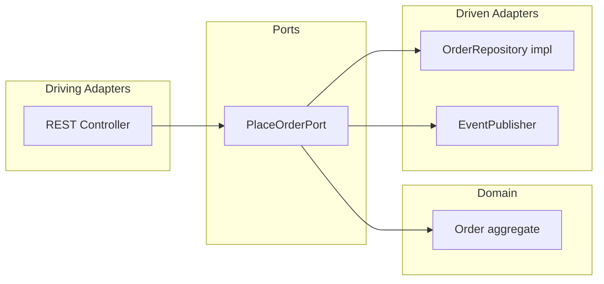

# Application Architecture Patterns — Spring Boot 4

**Spring Boot**: 4.0.x | Application architecture | **Jakarta EE**: 11

This reference covers hexagonal (ports & adapters), Vertical Slice Architecture, DDD mapping to Modulith, and optional CQRS. For module structure and event-driven communication, see `references/spring-modulith.md`. For Kafka messaging, see `references/spring-messaging.md`.

---

## Table of Contents

1. [Hexagonal (Ports & Adapters) with Spring](#1-hexagonal-ports--adapters-with-spring)
2. [Vertical Slice Architecture](#2-vertical-slice-architecture)
3. [DDD Mapping to Modulith](#3-ddd-mapping-to-modulith)
4. [CQRS (Optional)](#4-cqrs-optional)

---

## 1. Hexagonal (Ports & Adapters) with Spring

**Ports** are interfaces that define what the application needs (inbound: use cases; outbound: persistence, messaging, external APIs). **Adapters** are concrete implementations that plug into those ports: REST controllers, JPA/JdbcClient repositories, Kafka listeners.

The domain and use cases stay in the center with no framework dependencies; Spring only appears in adapter classes and `@Bean` configuration.

**Conceptual layout:**



**Port (interface):**

```java
package com.example.shop.orders.application;

import com.example.shop.orders.domain.Order;

public interface PlaceOrderPort {
    Order placeOrder(PlaceOrderCommand command);
}
```

**Use case (implements or uses the port from the “inside”):**

```java
package com.example.shop.orders.application;

import com.example.shop.orders.domain.Order;
import org.springframework.stereotype.Service;

@Service
public class PlaceOrderUseCase implements PlaceOrderPort {

    private final OrderRepository orderRepository;
    private final ApplicationEventPublisher events;

    public PlaceOrderUseCase(OrderRepository orderRepository, ApplicationEventPublisher events) {
        this.orderRepository = orderRepository;
        this.events = events;
    }

    @Override
    public Order placeOrder(PlaceOrderCommand command) {
        Order order = Order.create(command.sku(), command.quantity());
        orderRepository.save(order);
        events.publishEvent(new OrderPlacedEvent(order.id(), order.sku(), order.quantity()));
        return order;
    }
}
```

**Driven port (repository):**

```java
package com.example.shop.orders.domain;

public interface OrderRepository {
    Order save(Order order);
    Order findById(Long id);
}
```

**Adapter (REST):** The controller depends on the port (e.g. `PlaceOrderPort`) and delegates; the adapter is registered as a `@Bean` or the port is injected where the controller is defined. **Adapter (persistence):** A class in `internal/` implements `OrderRepository` using JdbcClient or JPA and is registered as a `@Bean`. **Adapter (messaging):** Outbound events can be published via `ApplicationEventPublisher` (in-process) or Kafka (see `references/spring-messaging.md`).

Each Modulith module can apply hexagonal internally: public API = driving ports (use cases); `internal/` = driven adapters (repositories, external clients). See `references/spring-modulith.md` for module package structure.

---

## 2. Vertical Slice Architecture

Organize by **feature / use case** instead of horizontal layers (controllers/, services/, repositories/). Each **vertical slice** contains everything needed for one capability: HTTP handler, application logic, persistence, and DTOs.

**Package layout example (within an `orders` module):**

```
com.example.shop.orders/
├── PlaceOrder/
│   ├── PlaceOrderController.java   # REST endpoint
│   ├── PlaceOrderCommand.java      # request DTO
│   ├── PlaceOrderHandler.java      # use case
│   └── OrderRepository.java        # port; impl in internal or same slice
├── GetOrder/
│   ├── GetOrderController.java
│   ├── GetOrderHandler.java
│   └── ...
└── internal/
    └── JdbcOrderRepository.java    # adapter shared by slices if needed
```

Each slice is a thin vertical: from HTTP (or message) down to persistence. Shared infrastructure (e.g. repository implementation) can live in `internal/` or a shared package. With **Modulith**, the module boundary is the root package (e.g. `orders/`); inside it you can structure by slices (PlaceOrder, GetOrder) or by role (OrderService, OrderController) — both are valid. Use Modulith’s verification and event-driven rules regardless; see `references/spring-modulith.md`.

---

## 3. DDD Mapping to Modulith

| DDD concept | Modulith mapping |
|-------------|------------------|
| **Bounded context** | One root package = one module (e.g. `orders/`, `inventory/`). |
| **Use case / application service** | Public service class in the module (e.g. `OrderService`) or a dedicated use-case class that the controller calls. |
| **Aggregate** | Domain entity (or group of entities) that the module’s service loads and persists as a unit. See section 10 “DDD & Modulith” in `references/spring-modulith.md` for aggregate and domain repository. |
| **Domain repository** | Interface in the module’s public or domain package; implementation in `internal/` (JdbcClient/JPA). Same as a “port” in hexagonal. |
| **Domain events** | Often represented as application events published via `ApplicationEventPublisher` and consumed by other modules with `@ApplicationModuleListener`. See “DDD & Modulith” in `references/spring-modulith.md` for domain vs application events. |

You do not need a separate “domain” package; the public API of the module can expose use cases and domain types (e.g. Order record). Keep infrastructure (repositories impl, HTTP clients) in `internal/` or in adapters.

---

## 4. CQRS (Optional)

**CQRS** separates the **write model** (commands, aggregates, transactional consistency) from the **read model** (projections, queries, possibly different storage).

**In a modular monolith (Modulith):** The module that owns the aggregate handles commands and publishes events (see transactional event listeners in `references/spring-modulith.md`). The same or another module can subscribe to those events and update a read model (e.g. a dedicated table or document store). Queries are served from the read model.

**Across services:** Use Kafka (or another message broker) to publish domain events; consumer services build and maintain their own read models. See `references/spring-messaging.md` for producers and consumers. Ensure idempotency and ordering guarantees in consumers when building read models.

Consider CQRS when read and write workloads or models diverge significantly (e.g. many reads with different shapes, or event-sourced writes with separate projections). For simple CRUD, a single model is often enough.

---

**Summary:** Use **ports (interfaces)** for use cases and repositories; implement them with **adapters** (REST, JPA/JdbcClient, Kafka). Structure by **Vertical Slice** per feature if it fits your team. Map **DDD** bounded contexts to **Modulith** modules and use the “DDD & Modulith” section in `references/spring-modulith.md` for aggregates and domain events. Use **CQRS** with event-driven updates when read and write models need to diverge; combine Modulith events and Kafka as needed.
